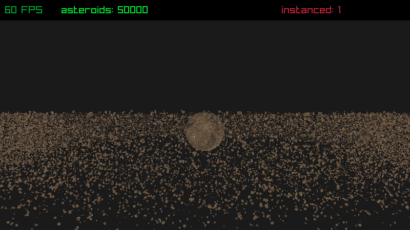
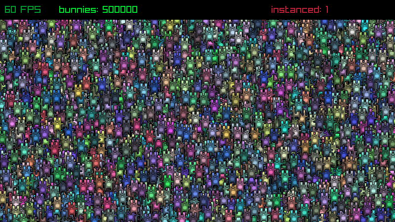

# raylib-instancing

Experimenting with instanced rendering support for raylib.

Currently uses a patch file for [rlgl](src/rlgl.patch) to add instancing support.

## Examples

[asteroids_instanced](src/instancing/asteroids_instanced.c)

[textures_bunnymark_instanced](src/instancing/textures_bunnymark_instanced.c)

## License

See [LICENSE](LICENSE) for details.
