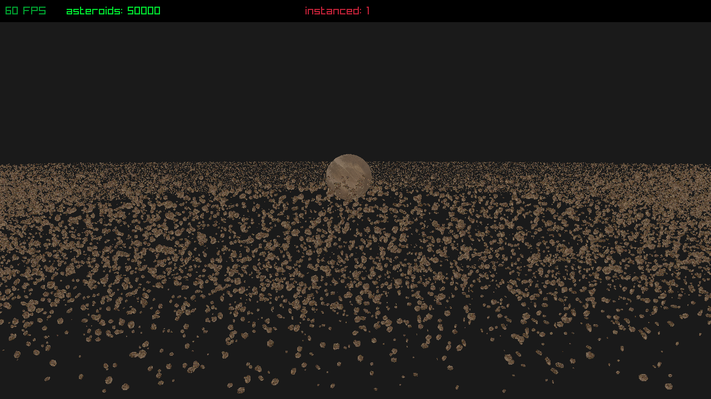
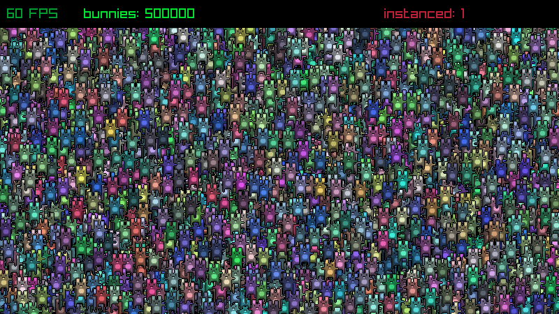

# raylib-instancing

Experimenting with instanced rendering support for raylib.

Currently includes the raylib src as modifications to [rlgl.h](raylib/src/rlgl.h) are required for instancing support.

## Examples

[asteroids_instanced](src/asteroids_instanced.c)

[textures_bunnymark_instanced](src/textures_bunnymark_instanced.c)

# License

See [LICENSE](LICENSE.md) for details.
